# MiKaEl — Manual de Usuario
## Índice
1. Introducción
2. ¿Qué es MiKaEl?
3. Requisitos del sistema
4. Instalación y primer inicio
5. Pantalla principal
6. Simulador de exámenes
7. Tipos de reactivo soportados
8. Uso de imágenes en reactivos
9. Uso de audio
10. Editor de exámenes
11. Importar y exportar exámenes
12. Importar preguntas con IA
13. Tarjetas de estudio (Flashcards)
14. Resultados y retroalimentación
15. Organización de carpetas y archivos
16. Recomendaciones de uso
17. Términos y Condiciones de Uso
18. Licencia y derechos de autor
---
## 1. Introducción

  

MiKaEl es una aplicación educativa que te sirve para simular exámenes, desarrollar habilidades, estudiar y poner a prueba tu razonamiento. 
Pero no se queda ahí, también es divertida, flexible y está hecha para acompañarte siempre en tu proceso de aprendizaje.

La aplicación empodera al estudiante, al profesor y al autodidacta, le da control, crecimiento y personalización. 
Puedes adaptar la experiencia a tu gusto y a tu ritmo, sin sentir que estudiar es una obligación pesada. 

Con MiKaEl tienes un guardián que te ayudará a estar listo para certificaciones, exámenes y capacitaciones alcanzando la excelencia. 
¡No estudies solo! 
MiKaEl estará contigo mientras practicas, evolucionas, corriges y mejoras.

El método que usa te va a gustar, porque hace que practicar sea sencillo y muy natural.
MiKaEl está pensada para usarse en cualquier moment, sin conexión a internet, en el transporte público, en ratos libres o en sesiones cortas pero constantes. 
La idea es que siempre puedas practicar, sin excusas.

Y algo importante, MiKaEl es, y siempre será, gratuita.

Este manual de usuario tiene como objetivo explicarte cómo funciona la aplicación y cómo aprovechar todas sus herramientas. 
Aquí encontrarás una guía clara para usar MiKaEl de forma segura, práctica y efectiva, tanto si solo quieres estudiar como si deseas crear tus propios exámenes.

  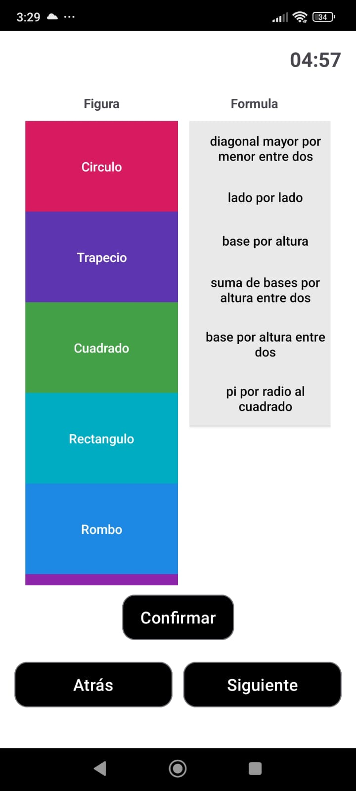
  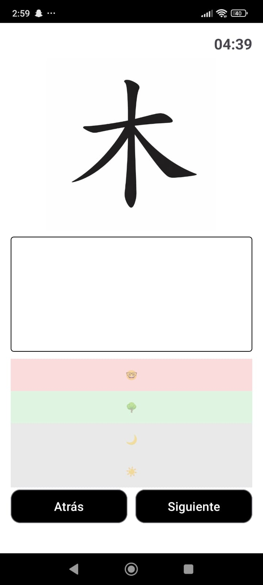
  

---
## 2. ¿Qué es MiKaEl?

-Un simulador de exámenes para practicar como sucedería en una certificación real.

-Un editor donde puedes crear tus propios exámenes.

-Una aplicación completa, con diversos tipos de preguntas y ejercicios.

-Una experiencia tipo videojuego, no una app aburrida.

-Una forma de entrenar tu razonamiento y mejorar con cada intento.

-Una herramienta para prepararte y alcanzar tus objetivos, como certificaciones, exámenes o capacitaciones.

-Una aplicación que puedes usar cuando quieras, incluso sin internet.

-Un guardián que te acompaña mientras practicas y mejoras.

---
## 3. Requisitos del sistema

Para usar MiKaEl necesitas:

- Un dispositivo Android.
  
- Espacio disponible para guardar exámenes y recursos.
  
- Elegir una carpeta para tus examenes.
  
No se requiere conexión a internet para estudiar o practicar.

---
## 4. Instalación y primer inicio
MiKaEl puede instalarse de dos formas:

- Desde la **Play Store**, buscando *MiKaEl* e instalando la aplicación normalmente.
  
- Desde el **repositorio oficial**, descargando el archivo correspondiente e instalándolo manualmente.
  
Al iniciar MiKaEl por primera vez:

- La aplicación te mostrará la opción para seleccionar una carpeta donde se guardarán tus exámenes.
  
- No necesitas crear una cuenta ni iniciar sesión.
  
- Puedes comenzar a usarla de inmediato.

---
## 5. Pantalla principal

  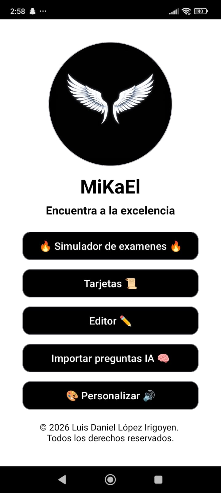

La pantalla principal es el punto de inicio de MiKaEl.  
Desde aquí eliges qué quieres hacer y comienzas a practicar.

En esta pantalla puedes:

- Entrar al **Simulador de exámenes**.
  
- Acceder a **Tarjetas** para estudiar en modo relajado.
  
- Abrir el **Editor** para crear y modificar tus propios exámenes.
  
- **Importar preguntas con IA** para generar nuevos contenidos con un prompt efectivo.
  
- **Personalizar** la apariencia, activar y descativar la vibración y el personalizar los sonidos de la aplicación.
  
- Desde la pantalla principal tienes acceso directo a todas las funciones clave de MiKaEl, sin menús complicados ni pasos innecesarios.

---
## 6. Simulador de exámenes

El simulador de exámenes es una de las funciones principales de MiKaEl.  
Aquí puedes poner a prueba tus conocimientos y practicar como si estuvieras en un examen real.

### Desde el simulador puedes:

- Seleccionar un examen disponible.
  
- Definir el tiempo de práctica por sección.
  
- Avanzar y retroceder entre preguntas.
  
- Responder a tu ritmo, sin presión.

- Ver imágenes o escuchar audios si el reactivo lo incluye.

  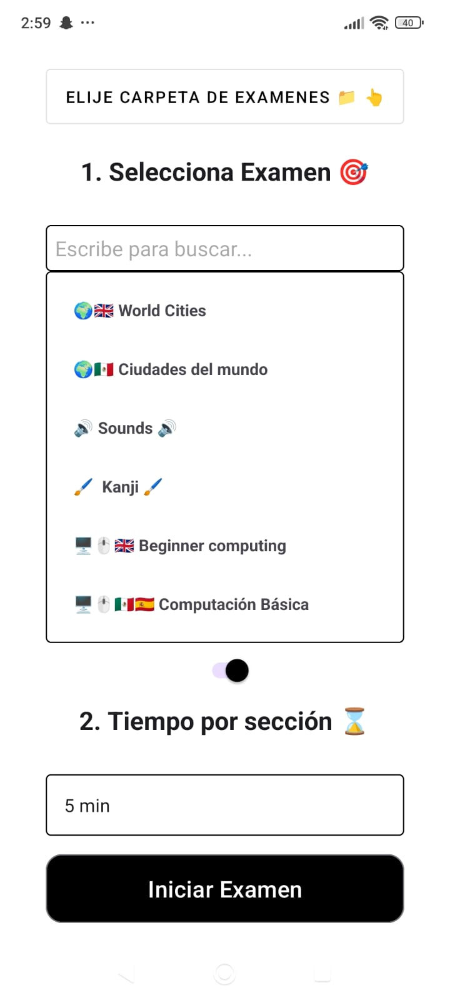

### Antes de comenzar

Antes de iniciar un examen, MiKaEl puede mostrar un archivo **intro.md** si el examen lo incluye.  
Este archivo se utiliza para:

- Explicar las reglas del examen.
  
- Dar instrucciones importantes.
  
- Aclarar el objetivo o la dinámica del ejercicio.

  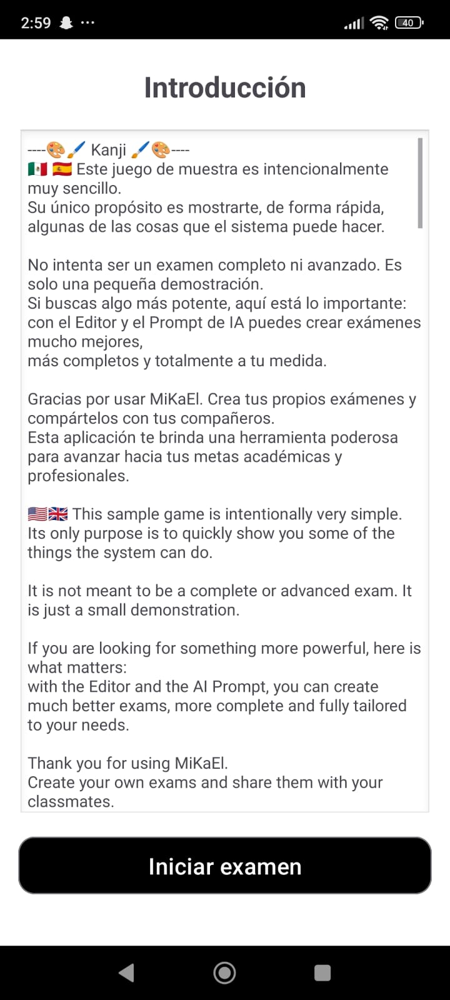

### Durante el examen

- Cada pregunta se muestra de forma clara.
  
- Puedes ver la imagen asociada al reactivo.
  
- Puedes reproducir el audio del reactivo.
  
- Puedes cambiar de respuesta antes de continuar.
  

    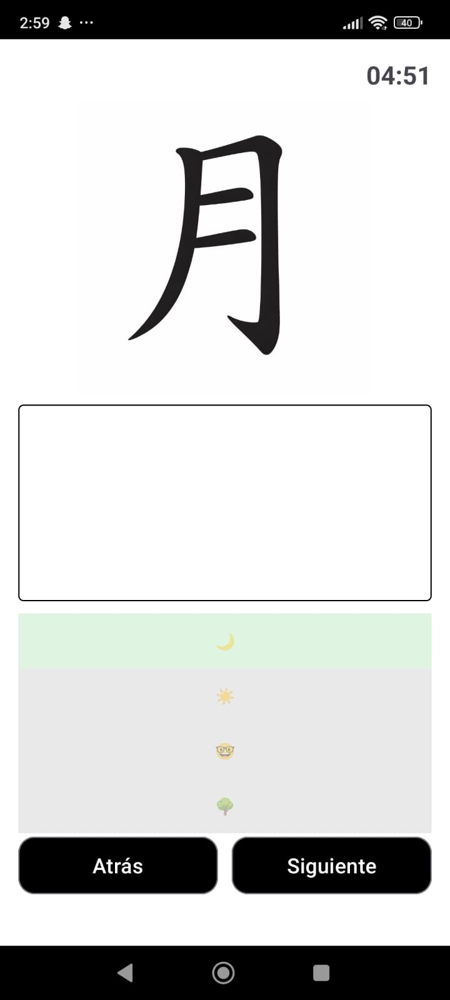
    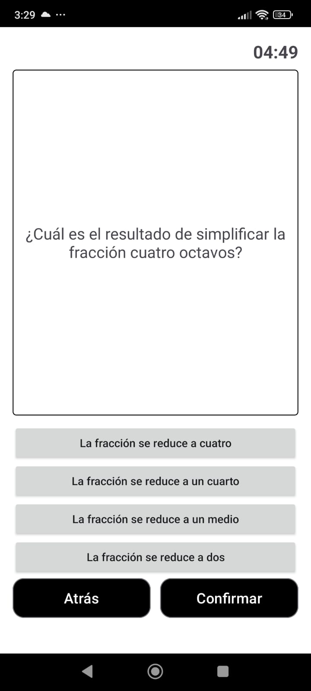  

### Al finalizar

- Obtienes un resumen de tus resultados.
  
- Puedes ver aciertos y errores.
  
- Recibes retroalimentación para identificar en qué mejorar.

El simulador está pensado para practicar, aprender de los errores y ganar confianza antes de una evaluación real.

    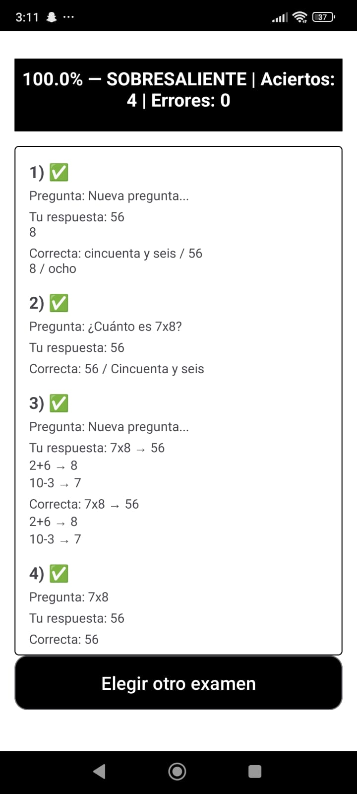
    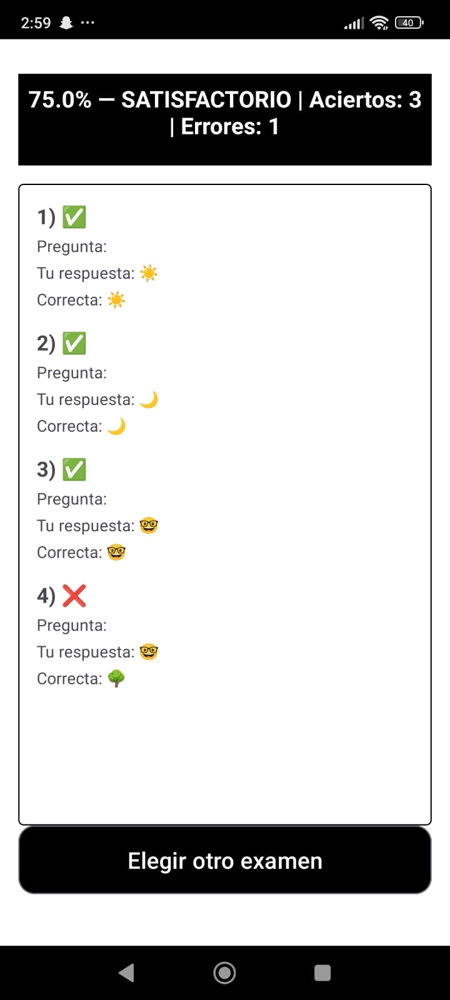

---
## 7. Tipos de reactivo soportados

MiKaEl soporta distintos tipos de reactivo para que los exámenes sean variados, completos y más interesantes.  
Cada tipo está pensado para evaluar habilidades diferentes.

Los tipos de reactivo disponibles son:

### Opción múltiple
- Preguntas con varias opciones de respuestas correctas.
  
- Solo una respuesta correcta.
  
- Ideal para exámenes tradicionales y certificaciones.

  

### Respuesta corta
- El usuario escribe su respuesta.
  
- Se pueden definir varias respuestas válidas.
  
- Opcionalmente puede distinguir entre mayúsculas y minúsculas.
  
- Útil para conceptos, definiciones o resultados directos.

  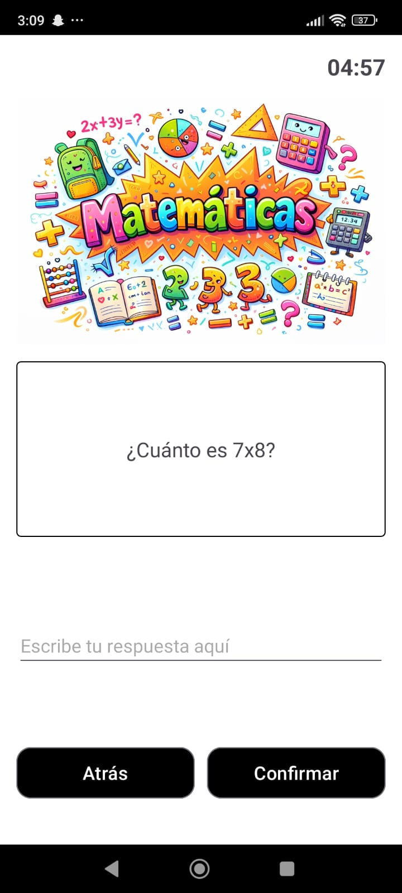

### Relación de columnas
- Consiste en relacionar elementos de una columna con otra.
  
- Evalúa comprensión y asociación de conceptos.
  
- Muy útil para fórmulas, definiciones o pares lógicos.

  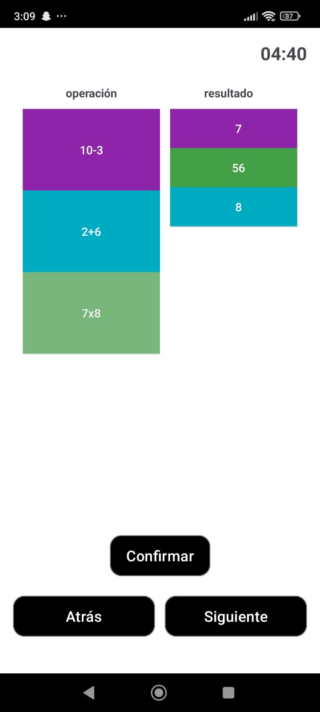

### Multireactivo RC
- Agrupa varias preguntas bajo un mismo contexto o lectura.
  
- Permite evaluar comprensión, análisis y razonamiento.
  
- Ideal para exámenes más complejos o de nivel avanzado.

Los de reactivo pueden incluir imágenes y audio, según se haya definido en el editor.
La combinación de estos reactivos permite crear exámenes más completos y disfrutables.

  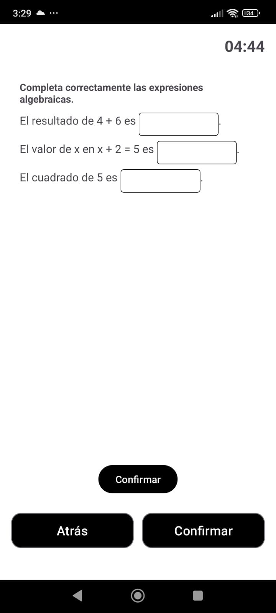

---
## 8. Uso de imágenes en reactivos

MiKaEl permite agregar imágenes a los reactivos para complementar las preguntas y hacerlas más claras o visuales.

### Las imágenes pueden usarse para:

- Apoyar la comprensión de una pregunta.
  
- Mostrar diagramas, gráficas o esquemas.
  
- Incluir fotografías o referencias visuales.
  
- Hacer los exámenes más dinámicos.

Las imágenes se agregan desde el **Editor de exámenes** y quedan asociadas al reactivo correspondiente.

### Durante el examen:

- La imagen se muestra junto a la pregunta.
  
- El usuario puede verla antes de responder.
  
- No es necesario contar con conexión a internet para que la imagen se muestre.

El uso de imágenes es opcional y depende completamente del creador del examen.

  
  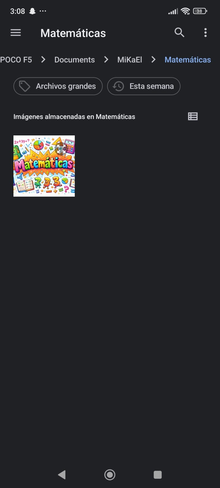
  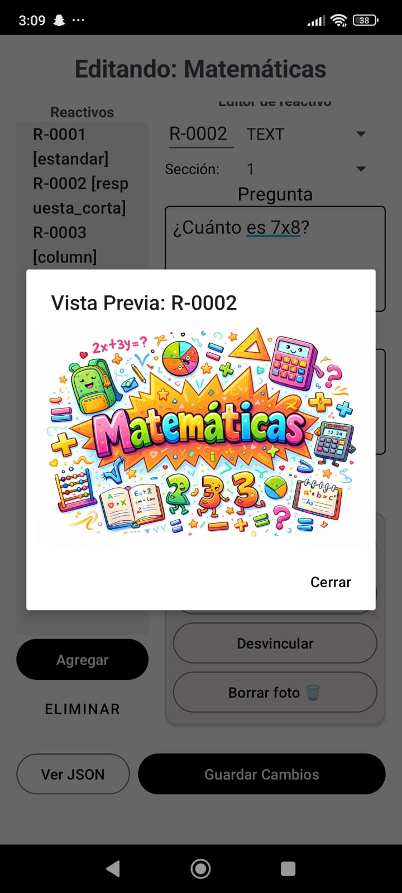

---
## 9. Uso de audio

MiKaEl permite agregar audio a los reactivos para complementar las preguntas y enriquecer la experiencia de estudio.

### El audio puede usarse para:

- Incluir instrucciones habladas.
  
- Agregar preguntas narradas.
  
- Evaluar comprensión auditiva y musical.
  
- Hacer el examen más dinámico.

El audio se agrega desde el **Editor de exámenes** y queda asociado al reactivo correspondiente.

### Durante el examen:

- El usuario puede reproducir el audio cuando el reactivo lo incluye.
  
- El audio se escucha directamente desde la aplicación.
  
- No se requiere conexión a internet para reproducirlo.

El uso de audio es opcional y depende del creador del examen.

---
## 10. Editor de exámenes

El editor de exámenes te permite crear, modificar y organizar tus propios exámenes de forma sencilla y visual.

### Desde el editor puedes:

- Crear nuevos exámenes.
- Agregar, editar o eliminar reactivos.
  
- Elegir el tipo de reactivo para cada pregunta.
  
- Definir respuestas correctas o aceptadas.
  
- Agregar imágenes o audio a los reactivos.
  
- Ver una vista previa del examen.

El editor está pensado para que tengas control total sobre el contenido, sin necesidad de conocimientos técnicos.

  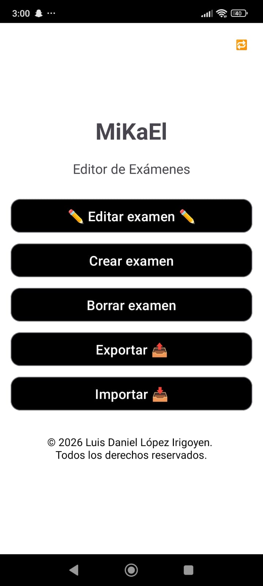

### Al crear o editar un reactivo puedes:

- Escribir la pregunta.
  
- Configurar las opciones de respuesta según el tipo de reactivo.
  
- Definir reglas como respuestas válidas o sensibilidad a mayúsculas.
  
- Asociar recursos visuales o de audio.

Los cambios se guardan directamente en el examen, y puedes volver a editarlo en cualquier momento.

El editor de exámenes es la herramienta principal para personalizar tu experiencia de estudio y adaptar MiKaEl a tus objetivos.

    
    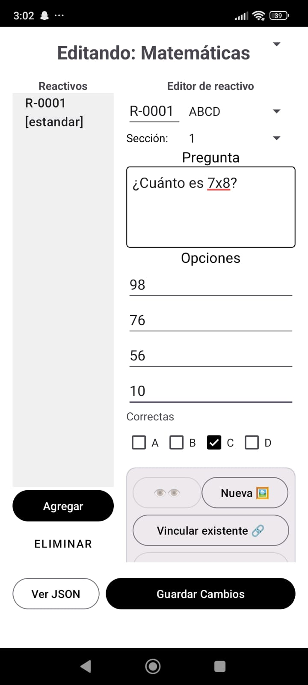

---
## 11. Importar y exportar exámenes

MiKaEl permite importar y exportar exámenes para que puedas respaldarlos, compartirlos o moverlos entre dispositivos.

### Exportar exámenes

Al exportar un examen:

- Se genera un archivo que contiene la información del examen.
  
- Puedes elegir qué exámenes exportar.
  
- El archivo puede compartirse por aplicaciones externas o guardarse como respaldo.

La exportación es útil para:
- Compartir exámenes con otras personas.
  
- Guardar copias de seguridad.
  
- Mover exámenes a otro dispositivo.

    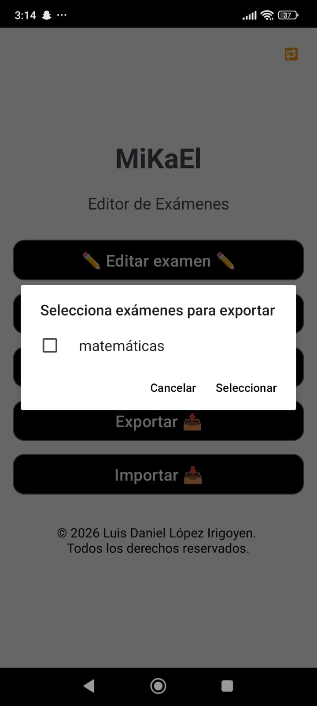
    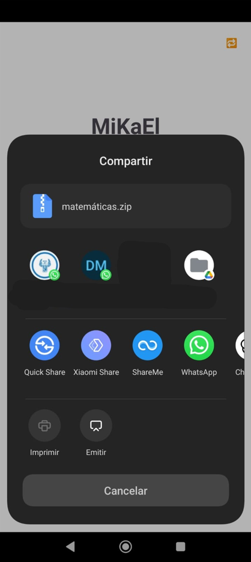
    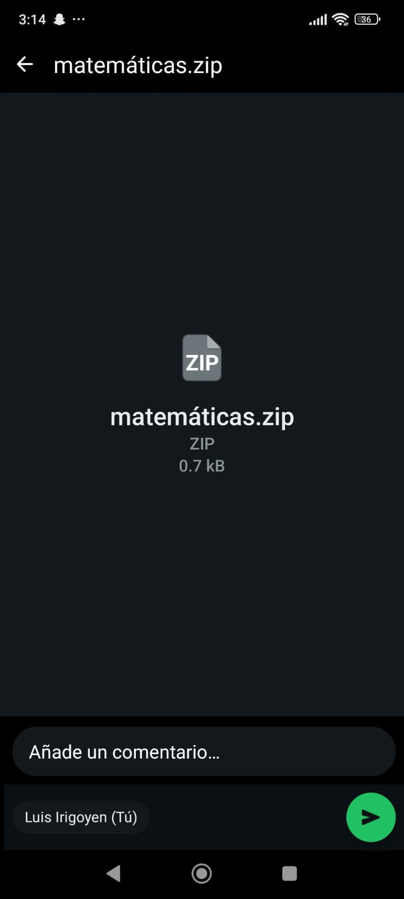

### Importar exámenes

Al importar un examen:

- MiKaEl lee el archivo y agrega el examen a tu lista.

- El examen queda listo para usarse o editarse.
  
- No se sobrescriben exámenes existentes sin confirmación.

La importación permite:
- Usar exámenes creados por otros.
  
- Recuperar exámenes previamente exportados.
  
- Integrar contenido nuevo de forma rápida.

La responsabilidad del contenido importado recae siempre en el usuario, verifica que lo que importas es seguro.

---
## 12. Importar preguntas con IA

MiKaEl permite importar preguntas generadas con ayuda de inteligencia artificial para agilizar la creación de exámenes.

Esta función está pensada como un apoyo, no como un reemplazo del criterio del usuario.

Al usar la importación con IA:

- MiKaEl proporciona un prompt estructurado.
  
- El usuario genera las preguntas usando una herramienta de IA externa.
  
- El contenido generado se pega o importa en la aplicación.
  
- Las preguntas quedan disponibles para editarse antes de usarse.

Es importante tener en cuenta que:

- El contenido generado por IA debe revisarse siempre.
  
- La corrección, calidad y pertinencia de las preguntas es responsabilidad del usuario.
  
- MiKaEl no garantiza que las preguntas generadas sean correctas o adecuadas para un contexto específico.

La importación con IA facilita la creación de exámenes, pero el control final siempre está en manos del usuario.

    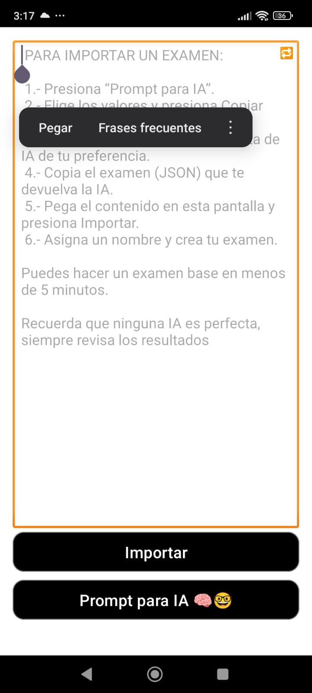
    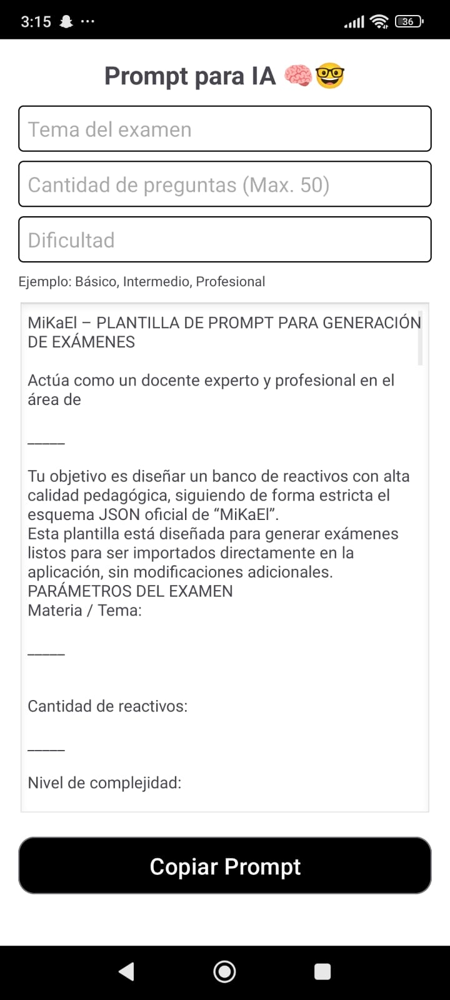
    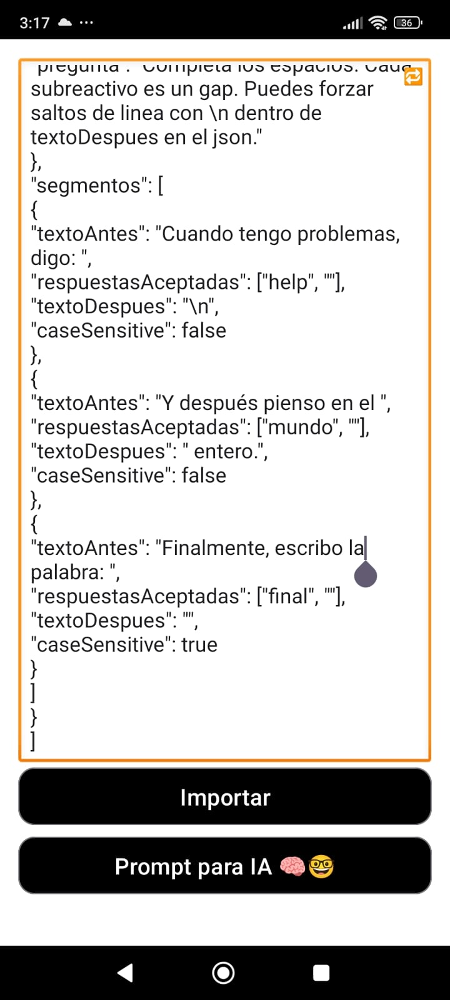
    

---
## 13. Tarjetas de estudio

Las tarjetas de estudio permiten repasar contenido de forma rápida y sin presión, ideal para memorizar, reforzar conceptos o estudiar en ratos cortos.

Con las flashcards puedes:

- Estudiar preguntas una por una.
  
- Concentrarte en un solo concepto a la vez.
  
- Repasar sin límite de tiempo.
  
- Usarlas como complemento al simulador de exámenes.

Las tarjetas se generan a partir de los exámenes disponibles, por lo que no necesitas crear contenido adicional.

Este modo es ideal para:

- Repasar antes de un examen.
  
- Estudiar en el transporte público.
  
- Aprovechar tiempos muertos.
  
- Reforzar temas específicos.

Las flashcards están pensadas para estudiar de forma ligera, constante y efectiva.

    
    
    
    

---
## 14. Resultados y retroalimentación

Al finalizar un examen, MiKaEl muestra una pantalla de resultados que te permite entender tu desempeño.

En esta sección puedes ver:

- Tu porcentaje de aciertos.
  
- La cantidad de respuestas correctas e incorrectas.
  
- Un resumen general de tu resultado.

Además, MiKaEl te permite revisar cada pregunta:

- Ver cuál fue tu respuesta.
  
- Compararla con la respuesta correcta.
  
- Identificar en qué fallaste y en qué acertaste.

La retroalimentación está pensada para ayudarte a aprender, no solo para mostrar una calificación.  
Revisar los resultados te permite detectar áreas de oportunidad y mejorar en los siguientes intentos.

Puedes usar esta información para:

- Reforzar temas específicos.
  
- Volver a estudiar con flashcards.
  
- Repetir el examen con mayor confianza.

Los resultados son una pieza clave del proceso de aprendizaje MiKaEl.

    
    

---
## 15. Organización de carpetas y archivos

MiKaEl utiliza carpetas para organizar los exámenes y sus recursos de forma ordenada.

Al iniciar la aplicación por primera vez, MiKaEl te pide seleccionar una carpeta principal.  
Dentro de esta carpeta se guardará todo el contenido de la aplicación.

DEntro de la carpeta principal cada examen se guarda en su propia carpeta, donde se almacenan:

- La información del examen.
  
- Los reactivos
- 
- Las imágenes asociadas.
  
- Los archivos de audio, si existen.
  
- El archivo **intro.md**, donde se puede poner una introduccion previa, contexto o reglas especiales.

Es recomendable:

- Mantener una carpeta por examen.
  
- No cambiar manualmente los archivos si no es necesario.
  
- Usar el editor de MiKaEl para hacer modificaciones.

Una buena organización de carpetas ayuda a evitar errores y facilita el respaldo, la importación y la exportación de exámenes.

    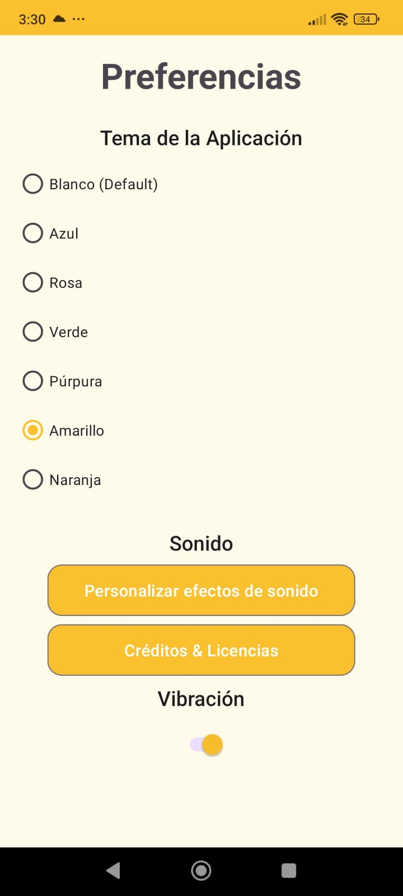
    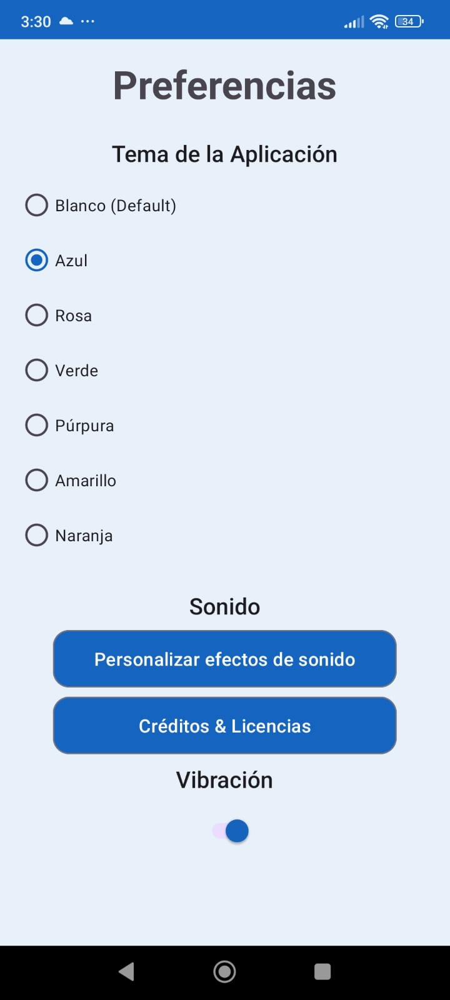
    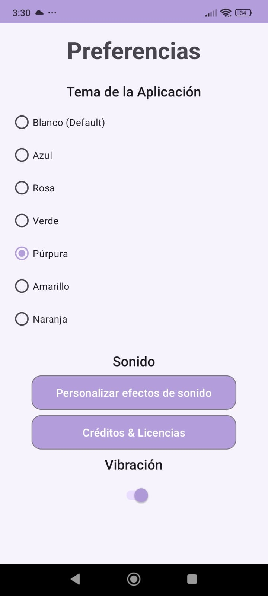
    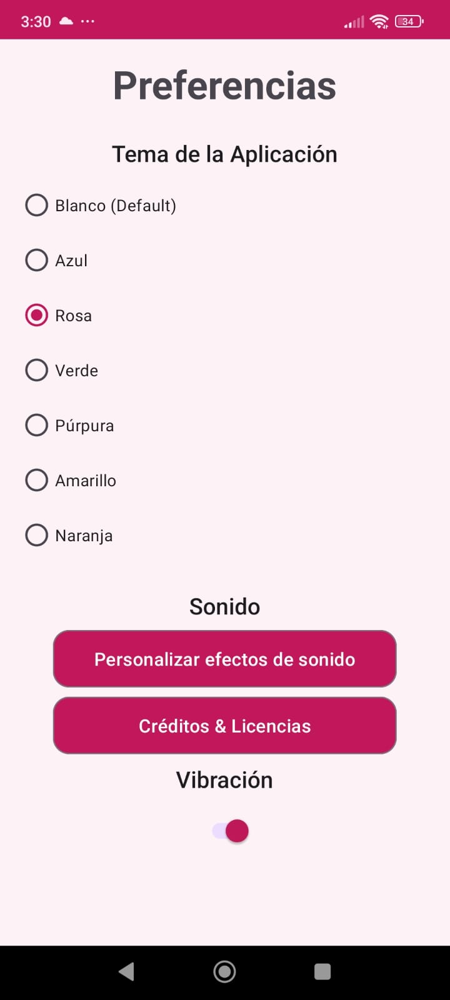
    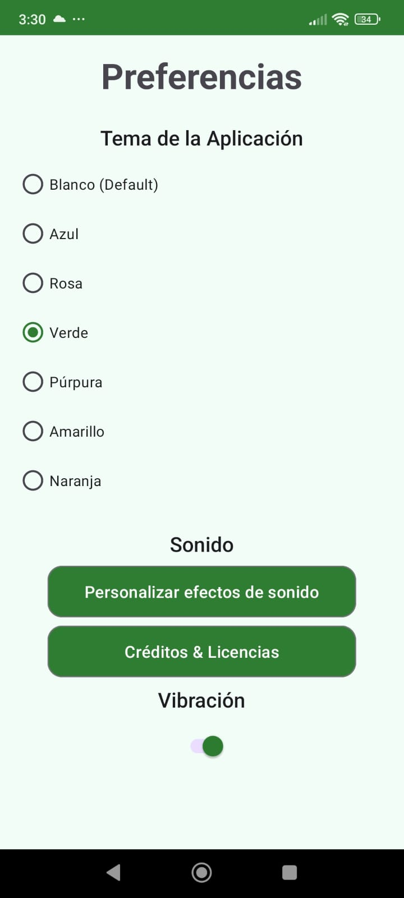
    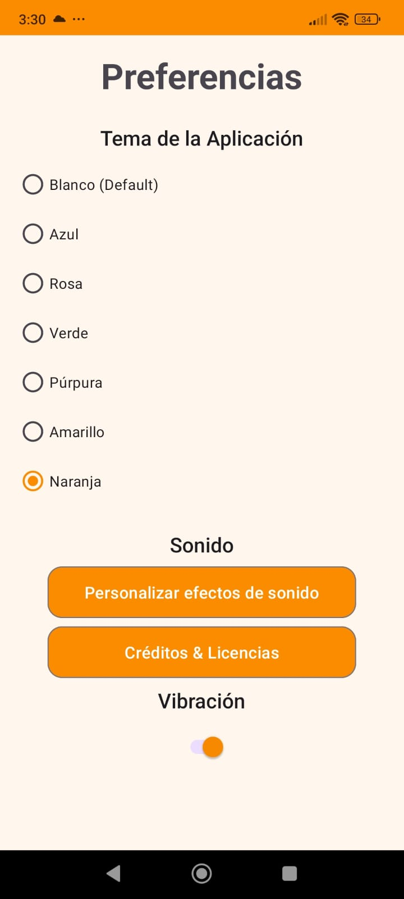

---
## 16. Recomendaciones de uso

Para aprovechar mejor MiKaEl, te recomendamos:

- Practicar de forma constante, aunque sea en sesiones cortas.
  
- Revisar tus resultados después de cada examen para aprender de tus errores.
  
- Usar las tarjetas de estudio para reforzar temas específicos.
  
- Crear exámenes claros y bien definidos si utilizas el editor.
  
- Revisar siempre las preguntas importadas, especialmente si fueron generadas con IA.
  
- Usar imágenes y audio solo cuando realmente aporten valor a la pregunta.
  
- Mantener organizadas tus carpetas de exámenes.
  
- Exportar exámenes importantes como respaldo.

MiKaEl está pensada para acompañarte en tu proceso de aprendizaje.  
Usarla de forma regular y consciente te ayudará a mejorar con el tiempo.

---
## 17. Términos y Condiciones de Uso

Al utilizar MiKaEl aceptas los siguientes términos y condiciones de uso.

### Responsabilidad del contenido

- Todo el contenido que crees, edites, importes o utilices dentro de MiKaEl es **tu responsabilidad**.
  
- La autoría de las preguntas, respuestas, imágenes, audios y textos siempre pertenece al usuario que los crea o importa.
  
- MiKaEl no revisa, valida ni garantiza la corrección, legalidad o calidad del contenido utilizado.

### Uso de exámenes importados o descargados

- Si importas o utilizas exámenes creados por terceros, eres responsable de su uso.
  
- MiKaEl no se hace responsable del origen, intención o consecuencias del contenido importado.
  
- El uso de exámenes descargados es bajo tu propio criterio y responsabilidad.

### Uso educativo y consecuencias

- MiKaEl es una herramienta de apoyo para el estudio y la práctica.
  
- No garantiza resultados académicos, certificaciones aprobadas ni evaluaciones exitosas.
  
- El uso de la aplicación en contextos académicos, laborales o institucionales es responsabilidad del usuario.

### Seguridad y uso indebido

- Eres responsable del uso que hagas de la aplicación y de los archivos que manejes.
  
- MiKaEl no se hace responsable por daños, pérdidas de información o consecuencias derivadas del uso indebido de la aplicación.
  
- Se recomienda usar únicamente contenido confiable y mantener respaldos de información importante.

MiKaEl es una herramienta pensada para ayudarte a aprender y practicar, pero el uso que hagas de ella y sus consecuencias dependen siempre de ti.

---
## 18. Licencia y derechos de autor

MiKaEl es una aplicación desarrollada con fines educativos y de aprendizaje.

El software MiKaEl y su documentación están protegidos por derechos de autor y se distribuyen bajo la licencia:

**Creative Commons Attribution–NonCommercial–NoDerivatives 4.0 International (CC BY-NC-ND 4.0)**

Esto significa que:

- Puedes usar la aplicación y la documentación de forma libre y gratuita.
  
- Debes dar crédito al autor cuando corresponda.
  
- No está permitido el uso comercial del software o su documentación.
  
- No está permitido modificar ni redistribuir versiones alteradas del software o del manual.

### Contenido creado por el usuario

- El contenido que crees dentro de MiKaEl (preguntas, exámenes, imágenes, audios, textos) es responsabilidad de quien lo crea, usa y/o importa.
  
- MiKaEl no reclama derechos sobre el contenido generado por los usuarios.
  
- El autor de la aplicación no se hace responsable del uso, distribución o consecuencias del contenido creado o compartido por terceros.

Luis Daniel López Irigoyen
Todos los derechos reservados.

---

